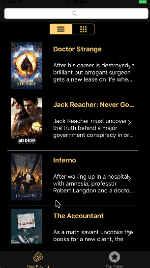

# Flicks
Flicks is an iOS app to display movies both top rated and currently playing in theaters. The purpose of this project is to demonstrate developing a basic MVC application with table and collection views.

This was done as a project for the [CodePath](http://codepath.com/) iOS for Engineers course.

## Features
* App is integrated with **[The Movie Database API](https://developers.themoviedb.org/3)**
* User can switch between movies currently playing in theaters and top rated movies
* User sees a loading indicator while waiting for API response
* User sees an error message if network request fails
* User can **pull to refresh** the movie list
* User can switch between a **list view** and a **grid view**
* Feed demonstrates **infinite scrolling** with a **loading indicator**
* User can search movie feed by title
* User can view movie details by tapping on a movie in the feed

## Demo
